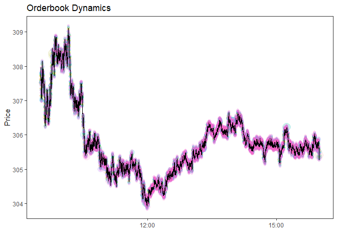

# lobsteR

<!-- badges: start -->
<!-- badges: end -->

The goal of lobsteR is to provide a tidy framework to request data from
lobsterdata.com, to download, unzip, and clean the data. The package
focuses on the core functionalities required to get LOBSTER data ready
fast, for subsequent typical high-frequency econometrics applications,
we refer to the `highfrequency` package.

## Installation

You can install the development version of lobsteR from
[GitHub](https://github.com/) with:

``` r
# install.packages("devtools")
devtools::install_github("voigtstefan/lobsteR")
```

## Example: Request and download data from lobsterdata.com

``` r
library(lobsteR)
library(tidyverse)
#> ── Attaching core tidyverse packages ──────────────────────── tidyverse 2.0.0 ──
#> ✔ dplyr     1.1.2     ✔ readr     2.1.4
#> ✔ forcats   1.0.0     ✔ stringr   1.5.0
#> ✔ ggplot2   3.4.2     ✔ tibble    3.2.1
#> ✔ lubridate 1.9.2     ✔ tidyr     1.3.0
#> ✔ purrr     1.0.1     
#> ── Conflicts ────────────────────────────────────────── tidyverse_conflicts() ──
#> ✖ dplyr::filter() masks stats::filter()
#> ✖ dplyr::lag()    masks stats::lag()
#> ℹ Use the conflicted package (<http://conflicted.r-lib.org/>) to force all conflicts to become errors
```

With `lobsteR` you can connect easily connect with lobsterdata.com using
your own credentials.

``` r
lobster_login <- account_login(
  login = Sys.getenv("user"), # Replace with your own account mail adress
  pwd = Sys.getenv("pwd") # Replace with your own account password
)
```

Next, we request some data from lobsterdata.com, e.g., message-level
data from *META* for the period from May 1st, 2023 until May 3rd, 2023.
´level´ corresponds to the requested number of orderbook snapshot
levels.

``` r
data_request <- request_query(
  symbol = "MSFT",
  start_date = "2023-05-01",
  end_date = "2023-05-03",
  level = 10)

data_request
#>   symbol start_date   end_date level
#> 1   MSFT 2023-05-01 2023-05-01    10
#> 2   MSFT 2023-05-02 2023-05-02    10
#> 3   MSFT 2023-05-03 2023-05-03    10
```

``` r
request_submit(account_login = lobster_login,
               request = data_request)
```

After submitting the request, lobsterdata.com will work on providing the
order book snapshots. Depending on the number of messages to process,
this may take some time. Once done, the requested data is available in
your account archive - ready to download!

``` r
lobster_archive <- account_archive(account_login = lobster_login)
```

When downloading, we automatically unzip the data (this can be omitted
using `unzip = FALSE`)

``` r
data_download(
  requested_data = lobster_archive |> filter(symbol == "MSFT"),
  account_login = lobster_login,
  path = "../tmp_data")
```

# Processing of Lobster files.

After downloading the data, use cases for Lobster data may differ. A
convenient way to work with order book snapshots is to combine message
and order book data first which allows for follow-up cleaning
procedures. The helper function `process_data` processes lobster files,
returns a clean, zipped `.csv` file and removes redundant raw files.

``` r
process_data(path = "../tmp_data")
```

Finally, we clean the order book files. Such procedures may be use-case
specific but typically, the following steps can be relevant:

- Identify potential trading stops (consult the Lobster documentation
  for this) and discard all observations recorded during the window when
  trading was interrupted. Sometimes, messages related to the daily
  opening and closing auction are included in the Lobster file
  (especially during days when trading stops earlier, e.g., before
  holidays).
- Remove such observations (opening auctions are identified as messages
  with type == 6 and ID == -1, and closing auctions can be identified as
  messages with type == 6 and ID == -2).
- Replace “empty” slots in the order book with ’NAs in case there was no
  liquidity quoted at higher order book levels. In that case, Lobster
  reports negative bid and large ask prices (above 199999). Remove
  observations with seemingly crossed prices (when the best ask is below
  the best bid).
- Market orders are sometimes executed against multiple limit orders. In
  that case, Lobster records multiple transactions with an identical
  time stamp. Aggregate these transactions and generate the
  corresponding trade size and the (size-weighted) execution price.
  Also, retain the order book snapshot after the transaction has been
  executed.
- The direction of a trade is hard to evaluate (not observable) if the
  transaction has been executed against a hidden order (\`order_type ==
  5’). Create a proxy for the direction based on the executed price
  relative to the last observed order book snapshot.

Each of the points above is implemented in the function `clean_data`.

``` r
orderbook <- clean_data(path = "../tmp_data/MSFT_2023-05-02_10.csv.gz")
```

Finally, we can analyse the orderbook files. The figure below shows the
dynamics of the traded prices (red points) and the quoted prices at the
higher order book levels.

``` r
orderbook_trades <- orderbook |>
  filter(type==4|type==5) |>
  select(ts, m_price)

orderbook_quotes <- orderbook |>
    mutate(ts_new = floor_date(ts, "10 seconds")) |>
    group_by(ts_new) |>
    summarise_all(dplyr::last) |>
    select(-ts_new) |>
    mutate(id = row_number()) |>
    select(ts, id, matches("bid|ask")) |>
    gather(level, price, -ts, -id) |>
    separate(level, into=c("side", "variable", "level"), sep="_") |>
    mutate(level = as.numeric(level))  |>
    pivot_wider(names_from = variable, values_from = price)

ggplot() +
  theme_bw() +
  geom_point(data = orderbook_quotes, 
             aes(x=ts, y=price, color=as_factor(level), size = size/max(size)), alpha = 0.1) +
  geom_step(data = orderbook_trades, aes(x=ts, y=m_price), linewidth = 0.1) +
  labs(title="Orderbook Dynamics",
       y= "Price",
       x="") +
  theme(panel.grid.major = element_blank(),
        panel.grid.minor = element_blank(),
        legend.position ="none") +
  scale_y_continuous()
```



Next, I compute the midquote, bid-ask spread, aggregate volume, and
depth (the amount of trade-able units in the order book).

``` r
orderbook_summaries <- orderbook |>
  transmute(ts,
    midquote = ask_price_1 / 2 + bid_price_1 / 2,
    trading_volume = if_else(type == 4 | type == 5, m_price * m_size, as.double(NA)),
    depth_bid = bid_size_1,
    depth_ask = ask_size_1,
    spread = 10000 * (ask_price_1 - bid_price_1) / midquote
  ) |>
  mutate(
    ts_latency = as.numeric(lead(ts)) - as.numeric(ts), # time between messages
    ts_latency = if_else(is.na(ts_latency), 0, ts_latency), # 0 for first message
    ts_minute = floor_date(ts, "30 minutes")
  ) |>
  group_by(ts_minute) |>
  summarise(
    midquote = last(midquote),
    n_trades = sum(!is.na(trading_volume)),
    n = n(), # number of messages
    trading_volume = sum(trading_volume, na.rm = TRUE),
    trading_volume = if_else(is.na(trading_volume), 0, trading_volume),
    depth0_bid = weighted.mean(depth_bid, ts_latency),
    depth0_ask = weighted.mean(depth_ask, ts_latency),
    spread = weighted.mean(spread, ts_latency)
  )

orderbook_summaries |> knitr::kable()
```

| ts_minute           | midquote | n_trades |      n | trading_volume | depth0_bid | depth0_ask |    spread |
|:--------------------|---------:|---------:|-------:|---------------:|-----------:|-----------:|----------:|
| 2023-05-02 09:30:00 |  308.095 |     1478 | 198354 |      229203080 |  143.02113 |  131.21635 | 1.3831351 |
| 2023-05-02 10:00:00 |  306.400 |     1550 | 297456 |      204995226 |   59.42056 |   94.74389 | 0.6900655 |
| 2023-05-02 10:30:00 |  305.225 |     1535 | 275886 |      143672592 |   66.57444 |   96.22889 | 0.6205947 |
| 2023-05-02 11:00:00 |  305.095 |     1445 | 222459 |      121771369 |   67.51500 |   74.59222 | 0.6228345 |
| 2023-05-02 11:30:00 |  304.165 |     1325 | 173694 |       90401857 |   63.86000 |   61.58611 | 0.6704186 |
| 2023-05-02 12:00:00 |  304.760 |     1066 | 130202 |       58181014 |   82.62556 |   69.69167 | 0.6254496 |
| 2023-05-02 12:30:00 |  305.095 |     1035 | 110693 |       59400355 |  109.66333 |   71.98778 | 0.5674270 |
| 2023-05-02 13:00:00 |  306.105 |     1094 | 107860 |       62342934 |   96.43722 |   85.55944 | 0.5668499 |
| 2023-05-02 13:30:00 |  306.190 |     1032 | 122258 |       73001960 |  123.25889 |  113.37333 | 0.5586895 |
| 2023-05-02 14:00:00 |  305.755 |     1053 | 154777 |       56535238 |  103.20611 |  105.18444 | 0.5734766 |
| 2023-05-02 14:30:00 |  305.810 |     1070 | 148002 |       57893729 |  126.25778 |  100.87444 | 0.5719214 |
| 2023-05-02 15:00:00 |  305.600 |     1142 | 145454 |       64077020 |  117.65333 |  112.72778 | 0.5948185 |
| 2023-05-02 15:30:00 |  305.430 |     1383 | 164758 |      183795397 |  141.63146 |  162.70206 | 0.5868798 |
